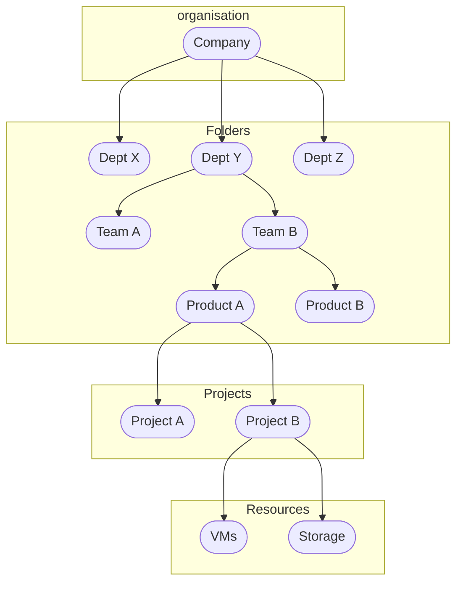
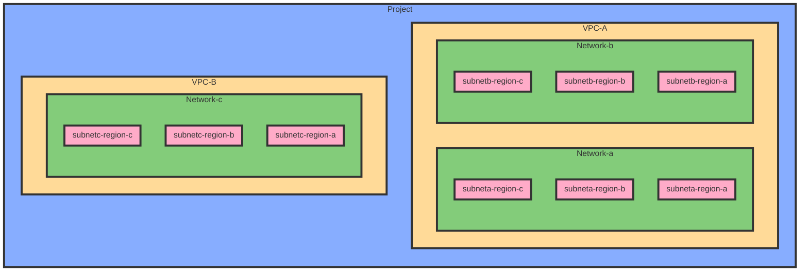

# Organization and project
## Hierarchy

1. Organization node (example.com)    -> Not available to free account
2. Folders -> Not available to personnal account. Organize projects into groups
3. Projects (example-test; example-dev; example-prod)
4. Ressources

Like file system, each ressource can only have one and only one project attached to and a project is attached to only one organization




## Folders

Group of projects that share common IAM policies
Role granted to folders apply to ressources inside
Managed in : IAM & Admin - Manage Ressources

## Projects

There are the core of GCP.
Identified by 3 ways :
- Project Name ("My super project" for instance) - Mutable
- Project ID (Unique on all google cloud plateform) - Immutable
- Project Number : Not directly used and assign by GCP - Immutable

Project is really deleted 30 days after the deletion has been submitted

Services and APi are enabled on a per-project basis

## Quotas

3 types of quotas:
- Ressources per project
- API rate limit per project
- Per region

Managed through support ticket or self service form (In the console -> Summit a request ticket to GCP support team)
Can be viewed in console : IAM & Admin - Quotas

## Labels
Almost any ressources can be labeled
Up to 64 labels per ressource

A label is a key/value pair. Example : env:prod; owner:matt, tier:front; tier:middle; state:unused

Different from tags that is used only for network and impact ressources operations.


# Virtual Network

## Hierarchy



## VPC
A VPC can exist in many regions
Virtual Private Cloud Network. Works as a physical network
Each VPC has its own managed firewall
It's possible to manage network routes
Each VPC contain one or many subnet. Can be configured automatic or custom. Only automatic (Automatic allocated subnet) can be convert to custom.

A VPC can contains up to 7000 instances (can't be increased)
Support only IPv4 unicast traffic (No broadcast or multicast) except for traditional AppEngine and global LB
Few regions supports IPv6 subnets

A VPC belongs to a project

### Shared VPC
Tie multiple projects into a single VPC within an organization
Host project: Project hosting the shared VPC

A shared VPC is created in one project and can be shared with other projects

There is also VPC peering


### VPC peering

Provide connectivity between two VPC even if they don"t belong to the same organization

### Firewall
By default all ingress traffic is blocked and all egress traffic is allowed.
Firewall act like Security Groups and Firewall

Single firewall for the entire VPC

Firewall rules are stateful

/!\ Second source filter is an OR with the first source filter
/!\ For load balanced applications, firewall rules for GCP LB must be set to the VPC Network (a list of few publics IPs classes)

Firewall rule assigment: By default, rules are applied to all instances, but you can assign certains rules to certain instance only

### Routes

Route tables are configured at the VPc level. There is at least one route per subnet.

By default, the mode is "regional dynamic routing": At the region level

"Global dynamic routing" can be activated to work at the VPC level on a multi region purpose

## Network

A project contains networks that an be shared/peered

A network is global and spans all available regions. It contains subnets

## Subnet
One subnet can only exist in one region (but in all zones of this region)

A subnet can be expanded but not shrinked

### Private Google Access

If enabled (Per subnet enablement), allows instances with private IPs to reach Google public API and services

### Alias IP range

Assign a full IP range to an instance network interface

### External IP adresses
Can be ephemeral (Automatic or Custom - And change every time the instance is restarted) or static (Reserved and attached to an instance)

Not directly attached to the instance but use NAT

### Cloud NAT

Is a network service than can be activated per subnet. Logs on NAT can be activated (An translation and errors, translation only or errors only)


## Cloud DNS

### Internal

Each instance can be internally resolved using: [hostname].[region-zone].c.[project-id].internal

Internal DNS resolver is provided by GCP using 169.254.169.254 IP address and configured on the intance by DHCP


### External

Cloud DNs can be used to managed DNS zone. There is no automatic public DNS entry publication for external IP address

## Interconnection with private Datacenter
### Cloud Interconnect
Give a discount on egress traffic charges
Provide a low latency connection

Can be dedicated (direct peering from 10 to 100 Gbps) or shared (partner interconnect from 50 Mbps to 10 Gbps)

Dedicated one need a connection in a Google Cloud colocation facility

Access type to private IP

### Direct Peering
It's a direct peering with the google network and not just a VPC Router or GCP
Exchange BGP routes

Can be dedicated or shared (carrier peering)

Acces type to google public IP (Interesting in high usage of Workspace or youtube for instance)

### VPN
Site to site connection over IPSec
Up to 3Gbps per tunnel and max 4 tunnels
Connect on-premise to GCP or two differents VPCs on GCP
Generally used with Cloud Router to announce to avoid static routing by using BGP

Multiple tunnels can be used for redundancy an rerouting traffic (HA-VPN) -> Use ecmp to dispatch flow


## Network pricing

- Free of charge: Egress / Ingress same AZ / Egress to Google products (Maps, youtube, ...) / Egress to a GCP service in the same region
- Paid traffic: Egress between AZ / Egress to the same AZ with external IP / Egress between regions


## Cloud Armor

The GCP WAF service


# Virtual Machine

## Compute Engine

IaaS model
Scaling with Server autocaling
General Workload

Can be:
   - Predefined machine type (Including shared core types)
   - Custom machine type
   - Spot and preemptible
   - Confidential compute
   - Shielded VMs

Shielded VM: Hardened instance with vTPM and secured boot with UEFI and Integrity Monitoring (Each one of these options can be activated or not independently). It requires shielded images

Network throughput scales 2Gbps per vCPU

Sole tenant node: Non shared hypervisor between customer nor projects

Instance can be moved to another zone within the same region

### Startup Scripts
Can be set directly or point to a file in cloud storage
Shutdown scripts are on a best effort. The vm can shutdown before the end of the script

To use a startup script through cloud storage, set url in metadata using key : startup-script-url

There is also 'shutdown-script-url' for shutdown script

### Preemptible VM

Max life of 24h

New version (actually in preview) is called spot VM


### SSH key management
Global SSH key management is in the Compute/Meta Data menu for console or through gcloud cli

### Cloud deployment manager
Use YAML format
Can use template (jinga2 or python)

```YAML
ressources:
- type: compute.v1.instance
  name: my-vm
  properties:
      zone: us-central1-f
      ...
```

Can use "REST API" information when creating a VM through web interface to have informations to help to complete the YAML file


## Disks
### Persistent disk
- Distributed on several disks
- Not physically attached
- Performance scale with size
- SSD option available
- Encrypted
- Max total size per instance : 64 TB (Except for shared core instances)
- Max 128 persistent disk per instance (Except for shared core instances)
- Scope of access : Zone (Same zone that the instance)
- Can be attached to multiple instances if read only

Exist in (From lower to higher performance):
- Standard
- Balanced
- Performance
- Extreme (You can provision your IOPS)

You can use sole tenant: A dedicated hypervisor (Overcommiting allowed)

#### Disk encryption

Can be:
- Managed by google
- Managed by customer (Google Cloud Key Management Service) - BYOK
- Customer supplied key (Manage outside of Google Cloud) - HYOK

### Local SSD
- Directly attached. Cannot be a boot disk
- Cannot be a boot device
- Must create on instance creation
- Encrypted only by a key provided by google
- Not automatically replicated
- 375 GB size (up to 8 per instance)
- Deleted when instance is deleted
- Can be SCSI or NVMe
- Cannot be snapshotted

Live migration (For Google maintenance for instance) is supported for instance that uses local SSD disk

### RAM Disk

Use for tmpfs

Faster than local disk.

Very volatil: Erased on stop or even restart VM


## Images
Can be created from a persistent disk or another image
Image families : Simplifies versioning and group related images together
Can be shared across projects -> Need rights that can be set to all images and not only one
Image can be shared on Cloud Storage as an .tar.gz image

Image state : Active, deprecated, obsolete, deleted

## Snapshots
Not shareable between projects
Snapshots work as differential backup.
 - First snapshot is a full snapshot
 - Second is differential from the full
 - Third is differential from the second
 - ...

If a snapshot is destroyed, link is not broken, the next snapshot is modified to included data differences between the previous one

Can be used on another region or zone (Also used to migrate a instance from one region to another by snapshoting it)
Can be used to recreate à disk


## Load Balancer and Instance groups
Group of instances. Can be managed or unmanaged
Managed groups
 - Auto scaling
 - Work with LB
 - If an instance crashes, it is auto recreated


### Load Balancer
Can be global or regional scope
3 types :
- Global external : HTTP(s) or SSL or TCP
- Regional external : TCP or UDP
- Regional internal : For internal load balancing

### Load Balancer scope

| Global HTTP(s) | Global SSL Proxy | Global TCP Proxy | Regional | Regional Internal |
| --- | --- | --- | --- | --- |
| L7 / Can use URL to select backend | L4 for non-HTTPS SSL traffic | L4 on non-HTTPS TCP traffic | Load Balancing of any traffic (TCP, UDP) | Load Balancing inside a VPC |

#### External HTTP(s) load balancer
Global scope and distribute traffic to closest region
Distribute traffic by location or content request
Paired with instance group
Native support for websocket protocol
External only

Use anycast IP

IPv4 or IPv6 and support QUIC

Port 80, 443 or 8080 only

GCS can be a backend

Can use NEG (Network Endpoint Group) that specifies a group of backend endpoints or services


Is based on GFE


#### Internal HTTP(s) load balancer

Is based on Envoy and support HTTP, HTTPs and HTTP/2

Support VMs instances in the same region only

#### External network load balancer
Balance request by IP address, port or protocole

Supports TCP, SSL

#### Internal network load balancer
Regional internal
Affects cloud router dynamic routing

Supports UDP and TCP

### External SSL Proxy load balancing

Global load balancing for encrypted non-HTTP traffic

Terminate the SSL sessions

Benefits:
- Intelligent routing
- Certificate management
- Security patching
- SSL policies

### External TCP Proxy load balancing

Global TCP LB for unencrypted non-HTTP traffic

Terminates TCP sessions

Benefits:
- Intelligent routing
- Security patching

### Instance groups and auto scaling
Can be mono or multi zones (but not multi regions)
Auto scaling can be based on : CPU usage, HTTP LB usage, Stackdriver metrics or multi criteria

Load Balancer contains one backend service
Backend service links to one or more backends
Backend links to one instance group

Instance group can be:
- Managed stateless: Autoscaling, auto healing, auto updating, multi AZ, Load Balancing
- Managed stateful: Disk preservation, autohealing, auto updating, multi AZ, Load Balancing
- Unmanaged: Load Balancing only

#### Health checks
Auto-healing : If an instance or service fails - delete and recreate identical instance

#### Managed instance group updater
Update entire groupExternal 
Based on : CPU / HTTP request / Pub/Sub queue / Monitoring metrics
Set a maximum and minimum instance number

#### Instance group update
- Create a new template
- Edit the instance group and choose rolling update
- Choose the canary update : All instance or a certain percentage
- Choose the update mode : proactive (run update now) or opportunistic (run update when isntances are created)

## Cloud Run

Deploy container to a Google managed Kubernetes Cluster

Serverless

Apps must be stateless


## App Engine
Is the PAAS solution of GCP
Provides managed : Firewalls, DOS, viruses, patch, network, Failover, LB, capacity planning, security, ...
New app Engine can only be deployed through gcloud cli

Exists in 2 versions : Standard and Flexible

### Standard
Can be used with Java, Python, PHP and Go
Can be auto-scaled to 0
Cannot write on local filesystems or modify the runtime environnement
Charges on instance hours (how often it's used)

### Flexible
Based on compute Engine
Auto scale up and down
Native for Java, Python, NodeJs, Ruby, .Net, ... or provide our own runtime
Charged by CPU, memory and disk usage

### App deployment
Need 3 files :
- app.yml contains deployment configuration and is used by gcloud app deploy
- config.py contains the application configuration (Storage, Database, ...)
- main.py imports code and loads configuration data


#### Requirements installation
Edit requirements.txt file to insert required dependencies
For python : use pip install -r requirements.txt -t lib (install all dependencies into the lib directory)

#### Deploy
In the project directory, use : gcloud app deploy
To list all app deployed : gcloud app instances list

#### Mutliple versions
Traffic can be split through multiple versions of the same app. It is configured through the version menu (split traffic) and can be based on IP addresses, cookie or random

### App Engine tools
- Cloud Shell local environnement : Used to test app in local
- Versions + Split traffic
- Firewall rules :
 - Default : Allow all
 - Control access only by IP range
 - Block malicious IP / DDOS


## Cloud functions

Ideal for an event-driven microservice architecture (Can be triggered on Pub/Sub message, storage bucket event or web request)


# IAM

Who / Can do what / On which resource

## IAM Objects

Cloud IAM relies on different objects:
- Organization
- folders
- Projects
- Resources
- Roles
- Members


## Members

4 types : 
- Google account: user@gmail.com
- Service account: 1234567@cloudservices.gserviceaccount.com or 1234567@project.gserviceaccount.com
- Google Group: groupname@googlegroups.com
- Cloud identity or google Workspace domain: user@mydomain.com


### User qccount (google account, Google group or Cloud Identity)

! Users and groups cannot be create or managed using cloud IAM

Active directory or LDAP can be synchronized with Cloud identity using "Google Cloud directory sync"

Cloud Identity can use a third party IDP with SAMLv2

### Service account

Service accounts are used to authenticate between services

Can be: 
- User created
- Build in (Compute engine and app engine default service account)
- API service account (Runs internal to Google processes on your behalf)

Service account uses a accountKey and not a password

Service account change on an instance need an instance reboot to take change into account

service account are google-managed or user-managed (Up to 10 service account per service)

#### Default compute engine service account

Automatically created per project and has the project editor role

In the form of 33xxxxx6666-compute@developer.gserviceaccount.com

By default its enabled on all instances created using gcloud or Cloud console


### Scope
Combine IAM roles with service account to grant per instance permissions to other GCP ressources (declared on the compute instance creation). IAM right is given for a complete VPC.

Service account can be changed without re-creating the VM

! For user-created service account, use cloud IAM roles instead

## Role and permissions
### Permission

Is formatted by <service.ressource.verb>
Exemple : compute.instances.delete

### Roles
User is assigned to role that is a collection of permissions
Example : user is assigned to compute.instance admin. This role is formed by differents permissions like compute.instances.get, compute.instances.delete, ...

3 types of roles:
- Basic
- Predefined
- Custom

#### Basic role
Applied to project level: Viewer / Editor / Owner / Billing administrator

#### Predefined role
Defined at ressource level (like InstanceAdmin, NetworkAdmin, ...)

#### Custom role
Like predefined but you can specified what permission is in it (Can delete a VM and create a network but nothin else for instance)


### IAM Policy
Full list of roles granted to a member or a ressource (Organization, folders, projects, services)

### IAM conditions

IAM policy that applies only when a configured condition is met. For instance: Authorize access to a certain group of people only when a production incident is in progress

### Organization policies

A policy that applies to a full organization (Folders, projects, ...)


### Policy hierarchy
Order : Organization (example.com) -> Folder (dept-x) -> Project (example-dev) -> Ressources (Compute Engine)
Children inherit parent role /!\

You can have a more permissive parent role and a more restrictive child role

! A children policy cannot restrict a policy granted at a parent level


## Organization node

An organization node is a root node for GCP.

Organization roles:
- Organization admin (Define IAM policies, Define the structure of the resource hierarchy and delegate responsibility through IAM roles)
- Project creator


## IAM best practices

- Audit the policies in cloud audit logs
- Audit membership of groups used in policies
- Least privileges
- Grant roles to groups instead of individuals
- Be careful granting serviceAccountUser role
- Give a display name to service account
- Establish key rotation for managed service account
- Audit
- Use cloud IAP to enforce accesscon,trol policies for http(s) applications


# Storage and databases
5 types of storage
- Object: Cloud storage
- File: Filestore
- Relational: Cloud SQL and Spanner
- Non-relational: Firestore and Bigtable
- Warehouse: BigQuery


## Cloud Storage
Object storage
Integrated with:
- Compute engine: startup scripts, images and oject storage
- SQL: Import and export tables
- BigQuery: Import and export tables
- App Engine: Object storage, logs, Datastore backups

Pay per usage
Data encrypted in transit and at rest

Organisation
Bucket : A basic container (Buckets cannot be nested)
For performance, it's better to have fewer buckets and more objects in each bucket
Bucket name must be unique in all GCP Platform
Objects : Can be up to 5TB. Stored in a bucket (Folders are also considered objects)

Storage class is configured at the bucket level

A bucket can have one of theses storage class:
- Standard
- Nearline: Used to store rarely accessed document (less than once a month) - Minimum 30 days
  - Read no more than 1 per month
- Coldline: Used to store very rarely accessed document (less than a year) - Minimum 90 days
  - Read no more than 1 per 3 months
- Archive: Backup, available immediatly. Minimum 1 year
  - Read no more than 1 per year

Except for Archive, storage class can be:
- Multi regional : Geo-redundant (inside a continent - Europe, Asia or US)
- Regional : Redondant inside a geographical region

Each storage class has the same throughput, latency and durability. Differences are from the availability (From 99% to 99.95%) and pricing for storage and access


Cannot change from multi-regional to regional (and vice versa)
Changing class only affect new objects (old objects class can be changed with gsutil)


No retrieval cost when the bucket and the user are in the same region (No Wan access). For instance : GCE in us-east1 and GCS Bucket multi-regioanl in us

### Security concept
#### Access management principles
Two methods : IAM and ACL

##### IAM
Granted to an individual bucket (but not objects)
Possible to gran access to manage bucket but not view/read objects inside

Standard Storage roles work independently from ACL
Legacy roles work with ACL (When a legacy role right is removed, ACL reflects the change)

Standard storage roles (work independently from ACLs) : Storage Admin / Storage Object Admin / Storage Object Viewer / Storage Object Creator
Legacy storage roles (work with ACLs) : Storage Legacy Bucket Owner / Storage Legacy Bucket Reader / Storage Legacy Bucket Writer / Storage Legacy Object Owner / Storage Legacy Object Reader

##### ACL
/!\ Bucket ACL cannot be set through webconsole
Can be applied to bucket or individual objects
Objects inherit ACL from default bucket ACL

Best practice : Use IAM over ACL whenever possible / Use ACL to grant access to an object without granting access to bucket / Use group over individual IAM users

Signed URLs : Times access to object Data
Useful to give a temporarly access to a ressource.
No need for a google account


### Features
#### Signed URL for temporary access
- Create a service account key in the API menu
- Set permission for 10 minutes : gsutil signurl -d 10m file_key.json gs://BUCKET_NAME/FILE
- Use the returned URL

#### Object versioning
Disable by default
When enabled, deleted and overwritten objects are archived
Object keeps the same name but paired with unique identifier number
If versioning disabled, existing versions remain but new ones not created

Archived versions retain own ACL


#### Lifecycle management
Applied to bucket level and can only be set through the CLI
Implemented with combination of rules, conditions and actions

If there are multiple conditions in one rule, all conditions must be met before action taken

Conditions can be : Age, CreatedBefore, IsLive, MatchesStorageClass, NumberOfNewerVersions
Actions : Delete, SetStorageClass

Can be configured through console or CLI

Object inspection accours in asynchronous batches

#### CSEK (Customer Supplied Encryption Key)

Use Customer supplied encryption key instead of google managed encryption key

#### Directory synchronization

Synchronize a VM directory with a bucket


#### Object change notification

Can be used to notify an application when an object is updated or added

It is recommanded to use Pub/Sub notification


#### Strong global consistency

Read after write / Read after metadat update / Read after delete / Bucket listing / Object listing

### Data import services

To import huge amount of data into GCS

- Transfert appliance: Rack, capture and ship data into GCS -> Network
- Storage transfer service: Import online data (Another bucket, S3 bucket, ...)
- Offline media support -> Physical


## Filestore

Fully managed NAS for GCE and GKE

Support NFSv3


## Cloud SQL
Host MySQL, MS SQL or PostgreSQL instance
vertical scale on read/write
horizontal scale on read only

Create an instance and price is the same than compute engine
Cannot connect through ssh to the instance but connection to mysql cli is possible through the gcloud cli :
 - gcloud sql connect SQL_INSTANCE_NAME --user=root


Can be configured in multi-az HA (Primary/Standby) with synchronous replication


Based on VM instance

Strongly consistent

## Cloud Spanner
Relational database like SQL but with horizontal scale

works at global scale

Strongly consistent

## Firestore
NoSQL document DB but with some SQL aspects
Scale from 0 to terabytes of data
Cost efficient
Support ACID transaction

Multi region replication

Next generation of cloud Datastore. It can works in:
- Datastore mode (for new server projects) - Compatible with datastore applications
- Native mode (for new mobile and Webapp)

"Serverless"

Strongly consistent

## Bigtable
Terabytes to petabytes of data
Apache HBase is born from Bigtable
Pricier than Datastore and charged whether using it or not (At least 3 instances except for developpement type which use 1 instance)
Use HBase Shell or scripts (google provides sample samples) to interact with HBase

Column DB

Based on VM instances

Eventually consistent


## Memorystore

Redis managed service

Eventually consistent


# Resource management

## Billing
Billing roles are defined in IAM (BillingAccountViewer, ...)

Billing accounts are linked to projects
Each project must be link to a Billing account and you cannot attach a new project to a billing account without thel BillingAccountUser role

An organization contains all billing accounts

Alerts can be set on budget

Billing can be exported into BigQuery or Cloud Storage (using CSV or JSON format)


Discount up to 57% for committed (for 1 to 3 years) : Engaged for a set amount of CPU and RAM (paid even if not used)

Sustained dicount offer discount according to the percentage of the month usage: Up to 30% net discount for an entire month running. It's calculated per vCPU for all running instances.


## Durability of data

| Storage | What GCP provides | What we should do |
| --- | --- | --- |
| Cloud storage | 11 9's durability | Recommanded to turn versioning on |
| Disks | Snapshots | Schedule snapshot jobs |
| Cloud SQL | Auto backup, Point int ime recovery, Failover server (optional) | Run SQL DB backup |
| Spanner | Auto replication | Run export jobs |
| Firestore | Auto replication | Run export jobs |


# Resource monitoring

Now, stackdriver has been renamed "Cloud's operations suite"


Can monitor AWS and GCP
You can use it with or without agent

Multiple integrated products:
- Monitoring
- Logging
- Error reporting
- Trace
- Debugger


## Monitoring

Monitor metrics, health checks, dashboards and alerts
A group of ressources can be created. This group can be filtered by a tag, a security group, a name, a project, ...

A workspace is the root entity that holds monitoring and configuration information. One workspace can monitor one or many projects

### Uptime check
Check HTTP, HTTPS or TCP and wait for a response code

### Alerting
Based on 4 elements
- Conditions : Uptime check, ...
- Notification : Email, SMS, slack, webhook, ...
- Documentation : Attach a doc to the alert message
- Name : Name of the alert policy


## Logging

Service Cloud logging

Audit of the activity. It's a repository for log data and events

Collect plateform, system and application logs (with agent)

Can generate log-based metrics

Real time and batch monitoring
Exports logs to other sources for long term storage using "sink" (to BigQuery or GCS or pub/sub)

Activate logging for all services (bucket access, ...) : Add this entries at the beginning of the policy.yaml IAM
```YAML
auditConfigs:
- auditLogConfigs:
  - logType: ADMIN_READ
  - logType: DATA_WRITE
  - logType: DATA_READ
  service: allServices
```


## Error reporting
Identify and understand applications errors

App Engine, App script, Compute Engine, Cloud functions, Cloud Run, GKE AWS EC2

CGE and GKE require a stackdriver logging agent

Work with : Java, Python, JavaScript, Ruby, C#, PHP and Go


## Trace
Find bottleneck on App Engine, Google HTTP(s) load balancers or applications instrumented with Cloud trace SDK

Automatically build into App Engine


## Debugger
Find/Fix code errors in production

Inspect application state without stopping or slowing app

Automatically build into App Engine
Available on GCE, GKE and GAE flexible with additional configuration


# Infrastructure automation

Outside terraform, ansible, ... GCP provides an automation managed services: Deployment manager

It uses a declarative language, can make parallel deployment and uses templates 

It uses yaml with jinja2 for templates and yaml for configuration


# Data managed services
## BigQuery
Stores and queries massive dataset
Use SQL syntax
Real time analysis

BigQuery organization:
- GCP Project -> Can be shared
- Dataset (group of tables) -> Can be shared (lowest level of access control)
- Tables -> row/column structures
- Jobs -> queuing large request

Serverless

## Dataflow
Data processing service based on Apache Beam
Can process data with 2 modes : Stream or Batch

Serverless
## Dataprep
Visually explore, clean and prepare data for analysis
Runs on top of Dataflow

Serverless

## Dataproc
Scalable clusters of Apache Spark and Apache Hadoop
Preemtible instances for batch processing recommanded

Managed services on top GCE

## Data Studio

Service to display and dash data and analytics


## Datalab
Interactive tool for data exploration, analysis, visualization and machine learning
Build on Jupyter


## Pub/Sub
Send and receive messages many to many (asynchronous)
Ideal for stream processing
Apps publish and subscribre to topics


# Design and process

## Defining services

To define a system from the user's point of view:
  - Who (Users, devs, stakeholders)
  - What
  - Why
  - When
  - How (How will it work? How many users, data?, ...)

User stories: Whan as [a role], I want to [action], then [results]


## KPIs, SLIs, SLOs and SLAs

KPIs must be SMART (Specific Mesurable Achievable Relevant Time-bound)

KPIs are metrics used to measure success. KPIs indicate whether you are on track to acheive the goal.

SLI: A measurable attribute of a service. A KPI
SLO: The number or the goal you want to achieve for a given SLI
SLA: A binding contract with compensation if the service doesn't meet specific expectations. It's generally more conservative than the equivalent SLO

KPIs are on:
- Availability
- Durability
- Scalability

## Availability, durability and scalability

Reliability depends on failure domains.

Be aware of cascading failure

Be careful of cycle overload: For instance if you have a failure and each client retry at the same time

Implement circuit breaker to protect the service from too many retries:
- Plan for degraded operations
- Protect the service behind a proxy that monitors the backend and don't forward  the request if the service is not healthy

Use lazy deletion to reliable recover when data is deleted by mistake.
- Use a kind of trash
- After a certain amount of time, perform a logical deletion
- After another amount of time, perform a hardware deletion


## Micro services 

The key to architecting micro services:
- Decompose applications by feature to minimize dependencies
- Organize services by architectural layer (Web, Android, IOS)
- Isolate services that provide shared finctionality (Like IAM, reporting, ...)

### Update strategy

- Rolling update: Have multiple version behind a LB (Default mode in Kubernetes)
  - Works only when it is OK to have 2 different versions running simultaneaously
- Blue / Green: Create a full new environment (the green) and when it has been tested, migrate client request to it
  - Use DNs with GCE to migrate to another load balancer
  - In GKE: configure the service to route to nexw pods using labels
  - In App Engine: Use traffic splitting
- Canary release: The current version continues to run and a few portion of the request move to a new version
  - Can be used prior to a rolling update

### Best practises

Avoid storing shared state in-memory even with sticky sessions (Better to use Firestore, Cloud SQL, ... for state and Memorystore for caching)

12-factor app:
- Code based versionned
- Explicitly dependencies
- Store config in the environment
- Backend services must be accessible via URLs (Databases, caches, ...)
- Separate Build, Release and RUN
- Execute app as one or more stateless process
- App are self contained and expose a port and protocol
- Scale out via the process model (Add more app instances)
- App must be design to be more reliable than the underlying infrastructure
- Keep Dev, Staging and Prod as similar as possible
- Treats logs as event streams
- Admin task should be repeatable and not one-off manual


### REST

Use HTTP or gRPC

Service endpoint supporting REST are called RESTful

POST - Create
PUT - Update


### APIs

Each GCP service expose a REST API

OpenAPI (Swagger) is industry standard to expose APIs to client

gRPC is a lightweight protocol for fast and binary communication.

gRPC is supported by GCP with Global load balancer (HTTP/2), Cloud endpoints and GKE with Envoy proxy

GCP provides 2 tools for managing APIs:
- Apigee API plateform
- Cloud endpoints. API management based on nginx reverse proxy


## Continuous integration

GCP provides all services:
- Cloud source repository: Private managed Git
- Cloud Build: GCP hosted docker build service
- Build trigger: Trigger builds on git repo changes (Support Maven, customer builds and Docker)
- Container registry (Private docker registry). It contains a vulnerability scanner

Binary authorization allos you to enforce deploying only trusted containers into GKE


# GKE : Google Kubernetes Engine
It's a fully managed environment for containerized application deployment
It uses compute engine ressources with kubernetes and a special customized OS (Container-Optimized OS)
It's a solution between Compute Engine and App Engine

It's integrated with GCP IAM and stackdriver

## When to choose Container Engine over App Engine
- Hybrid or multicloud
- Other protocols than HTTP/HTTPS
- Multicontainer solution (need orchestration)
- Want to use Kubernetes

## When ti choose Compute Engine over Container Engine
- Need GPU
- Non Kubernetes container solution
- Migrating legacy on premised to the cloud
- Custom OS

## GKE Components
### Container cluster
Group of instances. It contains at least 1 node instance

Support cluster scaling

Use containerd as runtime

### Kubernetes master
Manage the cluster

- kube-apiserver
- etcd
- kube-scheduler
- kube-controller-manager
- kube-cloud-manager
- On each node: kubelet
- On each node: kube-proxy

Cluster can be zonal or regional (Accross 3 AZ)

K8s control plane are managed and not exposed to the customer

### Pods
Group of one or more containers
Share storage and configuration data among containers
Pod can contain multiple containers

### Node
Individual instance that runs one or more pod

Nodes are grouped into node pools to manage different kind of nodes

### Replication controller
Ensures the number of pod replicas are always available and automatically adds or remove pods

### Services
Define a logical set of pods accross nodes and a way to access them using a single IP en port

### Container registry
Not part of GKE, but a separate service for private storage of our own Docker images

### Configure an application on kubernetes
- gcloud config set container/cluster CLUSTER-NAME : The cluster name to use
- docker build -t gcr.io/PROJECT_NAME/IMAGE_NAME . : Build the docker image
- gcloud docker -- push gcr.io/PROJECT_NAME/IMAGE_NAME : Push docker image to the GCP image hub
- gcloud container clusters get-credentials CLUSTER-NAME : Get an id for the Kubernetes cluster
- kubectl get APP : Obtain informations and the external IP of the application
- kubectl create -f APP.yaml : Deploy the application on Kubernetes
  APP.yaml sample :
```YAML
    apiVersion: v1
    kind: ReplicationController
    metadata:
      name: APP
    spec:
      replicas: 3
      template:
        metadata:
          labels:
            app: APP_NAME
            tier: frontend
        spec:
          containers:
          - name: APP
            image: gcr.io/PROJECT_NAME/IMAGE_NAME
            imagePullPolicy: Always
            env:
            - name: PROCESSES
              value: IMAGE_NAME
            ports:
            - containerPort: 8080
    ---
    apiVersion: v1
    kind: Service
    metadata:
      name: APP
      labels:
        app: APP_NAME
        tier: frontend
    spec:
      type: LoadBalancer
      ports:
      - port: 80
        targetPort: 8080
      selector:
        app: APP_NAME
        tier: frontend
```

### Cost

We can use GKE usage metering to prevent over-provisioning Kubernetes cluster. Metrics can be exporter to BigQuery for analysis.


# Security

## Logs

All google services write to audit logs:
- Admin logs
- Data access logs
- VPC flow logs
- Firewal logs
- System logs

## IAP: Identity Aware Proxy

Works with applications deployed behind HTTP(s) LB in GCE, GKE and App Engine

Force users to log in

Admin control who can access app

Allow access to Web based applications without VPN

Can act as an IDP as a service and provides federated login with different providers


## Network

Recommended:
- Use bastion host
- Bastion host can SSH into internal machine using IAP from console or CLI
- Use cloud NAT to provide egress internet access to internal machines
- Provide access to google cloud service using internally IP address
- Control access to API using Cloud Endpoints


## Cloud Armor

WAF and DDoS protection

Can also create network security policies


## Encryption

Google controls root keys in Cloud KMS. Keys are automatically periodically rotated

Keys can be managed by customer: Customer Managed Encryption Keys (CMEK)

Keys can be hold by customer: Customer Supplied Encryption Keys (CSEK)

## DLP

Cloud DLP can scans data in Cloud storag, BigQuery and Datastore

Can also scan images


# Planning a successful migration
5 steps :
- Assess : Define category (easy to move, hard to move, can't move)
- Pilot : Proof of concept, non critical and easily move, what process and roles to change, ...
- Move data
- Move applications
- Cloudify and optimize

## Architecting Cloud applications
- High availability : Can users access the application with minimal latency
- Scalability :
  - GCE : Managed instance group
  - GKE : Cluster with autoscaling
  - GAE : Autoscaler built-in
- Security
- Disaster recovery
  - GCE snapshot
  - Backup data to cloud storage

## Storage transfer service
Import online data into GCS : From AWS S3, HTTP location or another cloud storage bucket
For from on premise transfer, use gsutil

For very lagre transfer : Use mail-in with google transfer appliance


# Machine Learning
Based on neuronal network (TensorFlow) already trained

## Cloud Vision API
Detect and extract text
Classify image (Car, boat, lion, ...)
Detect inapropriate content
Detect celebrities, logos, ...

## Cloud natural language API
Reveal the structure and meaning of text
Extract informations about people, place, ...
Understand sentiment, ...

## Cloud Translate API
Language detection and translation

## Cloud Speech API
Convert audio to text and vice versa

## Cloud Video Intelligence
In beta for now
Video analysis, detect object, content, ...


# Case study
## EHR Healthcare

Probem: Migration from on prem to cloud, scalability

Business requirements:
- Availability can be increased by hosting into multiple AZ
- Cloud monitoring can be used for central obsevability
- Data can be pushed into BigQuery and be visualized using Data Studio
- Latency can be reduced using Global Load Balancer
- Regulatory compliance can be achieved using data localization and retention
- Decrease in frastructure cost can be achieved by using Terraform or Deployment Manager
- Predictions and reports on industry trends can be done using BigQuery

Technical requirements:
- Customer facing applications container based can be runned on GKE or Cloud Run with consistent CI/CD an Anthos for on prem
- GCP - On prem interconnection can be done by using Cloud VPN, Dedicated or Partenered Interconnect
- Consistent logging, monitoring and alerting can be made using Cloud Monitoring and Cloud Logging
- Maintain and manage multiple container based environnement can be achieved with IaaC or Deployment Manager
- Dynamic scalability and new environement provisionning can be achieved using GKE with Cluster Autoscaler 
- Propose interface to insurances providers using Apigee

Solutions: Multi regional VPC / GKE / Anthos / Apigee / AI Plateform / Pub/Sub / Cloud Storage / Dataflow / Cloud Composer / Cloud SQL / Cloud Memorystore / Cloud Firestore / Cloud monitoring / Cloud Logging / Terraform / Cloud Source Repositories / Cloud Build / Artifact Registry


## Helicopter Racing League

Problem: Cloud AI and ML, telemetry and streaming


Business requirements:
- Expose predictive model to partners
- Increase predictive capabilities (race results, mechanical failures, crowd sentiments, ...)
- Increase telemetry
- Increase global availability
- Ensure compliancy


Technical requirements:
- Increase prediction accuracy
- Reduce latency
- Create real time analytics
- Enable processing of large volume of data


Solutions: Preemptible VM for encoding / GKE / App Engine / Pub/Sub / Dataflow / BigQuery / Cloud Composer / Cloud Monitoring / Cloud VPN / Cloud CDN / Cloud Storage / AI Plateform / BigQuery

## Terram Earth

Problem: Cloud automation, operation and API ecosystem

Business requirements:
- Increase the number of connected vehicule
- Predict malfunction and ship part rapidly
- Handle data using Cloud Pub/sub, Cloud IoT and Dataflow to capture cellular data
- Use BigQuery and cloud ML to do some analytics
- Can partner with different companies using Cloud Enpoints to expose APIs

Technical requirements:
- Decrease American latency using multi regional Cloud Storage
- Bakcup data using Cloud Storage or BigQuery
- Increase the security of data transfert using HTTPs
- improve data warehouse using BigQuery
- Anticipate customer needs using machine learning models


Solutions: Bigtable / Pub/Sub / Dataflow / GKE / Auto ML / Cloud IoT / Cloud Monitoring / Cloud KMS / Apigee / GKE / Cloud Source Repository / Artifact Repository / Cloud Build / DLP / BigQuery


## Mountkirk Games

Problem: Auto scaling and gaming analytics

Business requirements:
- Increase global footprint using Global Load Balancer
- Increase efficiency using auto scaling and GKE
- Reduce latency using Global HTTP LB and multi regional resources
- Support multtiple gaming plateform, regions
- Support rapid iteration of game features
- Minimize costs


Technical requirements:
- Dynamically scale up/down using auto scaling and GKE
- Multi region spanner cluster
- Publish scoring on a near realtime
- Store games activity logs in structured files for future analysis
- Use GPU to render graphic server side
- Support eventual migration of legacy games to this new plateform


Solutions: Spanner / GKE / Global Load Balancer / Pub/Sub / Dataflow / BigQuery / Looker / Datastore / GCS / Cloud operations and APM


# Global commands
- gcloud config set compute/zone (ZONE)
- gcloud auth list
- gcloud config list

- gcloud compute instances create NAME --labels contact=matt,state=inuse,env=prod
- gcloud compute instances update NAME --update-labels contact=matt
- gcloud compute instances update NAME --remove-labels label_name

- gcloud source repos clone NAME

- gcloud datastore create-indexes FILE_DESCRIPTOR.yaml

- gcloud debug logpoints list
- gcloud beta debug logpoints create FILE.py:NUM_LINE "Message log"

## IAM Policy management
- gcloud projects get-iam-policy PROJECT_NAME --format json > policy.json
- gcloud projects set-iam-policy PROJECT_NAME policy.json

## Network
- gcloud compute firewall-rules create NAME --allow=tcp:port --network=NETWORK --direction=INGRESS --source-range=0.0.0.0/0 --target-tags=TAG_NAME --priority=1000
- gcloud compute firewall-rules list

## Compute
- gcloud compute instances add-tags VM_NAME --tags TAG_NAME
- gcloud compute instances create --project PROJECT VM_NAME --zone "us-east1-b" --machine-type "n1-standard-1" --subnet "default" --no-scopes --tags TAG --image "centos-7-v20171213" --image-project "centos-cloud" --boot-disk-size "10"

## Disks
- gcloud compute disks move DISK_NAME --zone=ZONE_SRC --destination-zone=ZONE_DEST
- gcloud compute disks create NAME --zone=us-east1-b --type=pd-ssd --size=20GB
- gcloud compute disks delete NAME --zone=us-east1-b
- gcloud compute instances attach-disk SRV_NAME --disk DISK_NAME
- gcloud compute disks resize DISK_NAME --zone=ZONE --size 100

## Images
- gcloud images create NAME --family=FAM_NAME --source-disk=DSK --source-disk-zone=us-east1-b

## Deployment manager
- gcloud deployment-manager deployments create DEPLOYMENT_NAME --config deploy.yml

## Container
- gcloud container builds submit --tag gcr.io/gcp-linuxacademy/nginx-mick .    // With the Dockerfile in the directory
- gcloud container images list
- gcloud container clusters resize CLUSTER_NAME --zone=us-central1-a --size=5

## gsutil commands
- Create bucket : gsutil mb  gs://BUCKET_NAME
- Change rights : gsutil defacl ch -u AllUsers:R gs://BUCKET_NAME
- gsutil ls -l gs://BUCKET_NAME
- Web access to bucket : https://storage.cloud.google.com/BUCKET_NAME

- gsutil iam ch user:user@gmail.com:objectCreator,objectViewer gs://BUCKET_NAME/
- gsutil iam ch -d user:user@gmail.com:objectCreator,objectViewer gs://BUCKET_NAME/  // Remove specific role
- gsutil iam ch user:user@gmail.com gs://BUCKET_NAME/   // Remove all roles

- gsutil acl ch -u user@gmail.com:[O|R|W] gs://BUCKET_NAME/[FILE|\*.png] (AllUsers can be used to set a public link)
- gsutil acl ch -d user@gmail.com gs://BUCKET_NAME/[FILE]       // Remove ACL rights

- gsutil versioning get gs://BUCKET_NAME/
- gsutil versioning set on gs://BUCKET_NAME/
- gsutil ls -a gs://BUCKET_NAME     // Liste files with version ID (include versioned removed files)
- gsutil rm gs://BUCKET_NAME/file#version_id     // Remove permanently a file even if versioned

- gsutil lifecycle get gs://BUCKET_NAME > policy.json
- gsutil lifecycle set policy.json gs://BUCKET_NAME

- gsutil rm -r gs://BUCKET_NAME     // Delete bucket and content

- gsutil rewrite -r -s NEARLINE gs://BUCKET_NAME/*     // Rewrite file into nearline storage class (-r for recursive)
- gsutil -m ...     // Multiple thread for speed improvement
