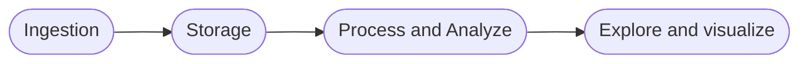
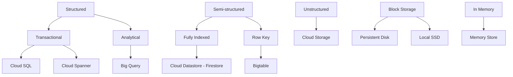

# Overview

Data flows:

## Ingest

### Applications

- Logging
- Pub/Sub
- Cloud SQL
- Datastore
- Cloud Bigtable
- Firestore
- Spanner

### Streaming

- Pub/Sub

### Batch

- Google Cloud Storage
- Storage transfer service
- BigQuery data transfer service
- Transfer appliance

## Storage

## Process and analyze

- Cloud Dataproc
    - Existing Hadoop/Spark applications
    - Machine Learning / Datascience 
    - Tunable cluster parameters
- Cloud Dataflow
    - New data processing pipeline
    - Unified streaming and batch
    - Fully managed
- Cloud Dataprep
    - UI-Driven data preparation
    - Scale on demand
    - Fully managed

## Explore and visualize

- Data Studio
    - Dashboard an visualization
- Datalab
    - Interactive Jupyter notebook
    - Support all datascience library
- ML pre built API
    - Vision API / Speech API / ...

# Type of data

## Structured data

- Tabular data
- Use rows and columns (Each row has the same numer of column)
- Fixed schame
- SQL langage

-> Relational databases: Cloud SQL / Sloud Spanner

## Semi structured data

- Each record has a variable number of properties
- No fixed schema
- NoSQL kind of data
- Stored as key-value pair

-> NoSQL database: Bigable / DataStore : MemoryStore

## Unstructured data

- No pre defined structure in data

-> GCS: Google Cloud Storage

## Batch data / Straming data

### Batch data

- Defined end and start of data (Data sized is known)
- Long time to process

### Streaming data

- No end of data stream defined
- Size is unkown
- Is processed as it arrives

# GCS - Google Cloud Storage

## Location

- Region: Replicated accross multiple AZ
- Dual-Region: Use paired region. Includes auto-failover. For instance like (Netherland - Finland)
- Multi-Region: Accross continent area like US, EU, Asia. Includes auto-failover. For instance: Multiple region in US or in EU, ...

## Storage class

- Standard: Hot data
- Nearline: Data accessed less than one in a month
- Coldline: Data accessed less than one in a quarter
- Archive: Offilne data (less than one in a year)

## Lifecycle

Based on conditions and applied to a bucket

Condition (Object age, object file type, specific date, ...) -> Action (Change storage class, deletion)

## Encryption

- Google managed encryption: By default
- CMEK - Customer managed encryption key: Use Cloud KMS and Key is managed by customer (Like rotation)
- CSEK - Customer supplied encryption key

## Object Versioning

Configured at the bucket level

## Access control

At project level:
- IAM
- Pre defined roles (Storage admin, storage object admin, storage object creator, storage object viewer)
- Custom role

At bucket level:
- Assign role to user or GCP services

At object level:
- ACL for each object separately

## Signed URL

Temporary access (Max period is 7 days)

access can be provided to user who doesn't have a google account

## Bucket retention policy

Minimum duration for which object in the bucket will be protected from deletion or modification

# Data transfer service

Is accessible from the "Data transfer" service

- From on premise to GCS
  - Online: gsutil
  - Online: with an agent
  - Offline: Transfer appliance
- From on GCS bucket to another one
- Fom other public cloud (S3, Azure) to GCS
  - Can be a one time run or recurring

# Block storage and file store

## Persistent disk

Network attached Block device. Can be zonal or regional. Permanent and cheaper than local SSD

## Local SSD

Local SSD are physically attached to VM. Do not persistent once VM is destroyed

Cannot be reattached to another VM. No snapshot

## File store

Fully managed NAS.